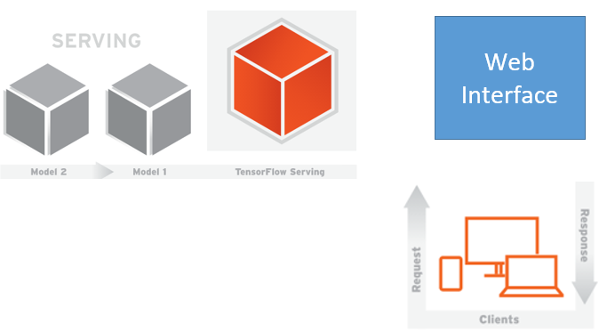
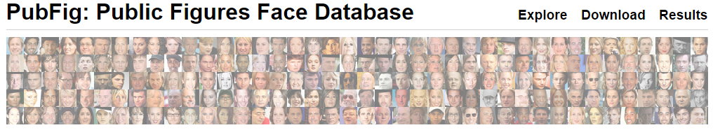
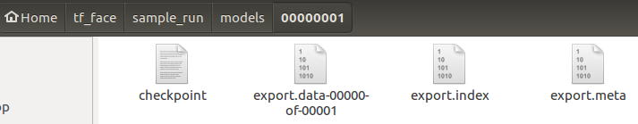

# Architecture

## Overall



* Data: pubfig <http://www.cs.columbia.edu/CAVE/databases/pubfig/>
* Tensorflow: Machine Learning Lib
* Tensorflow Serving: Predict serving
* Opencv: face detect
* Web Interface: Game interface
* Bazel: build Tensorflow Serving & Web interface

## Data: Pubfig

The PubFig database is a large, real-world face dataset consisting of 58,797 images of 200 people collected from the internet.



### Output

* face images
* traning list
* validation set

## Tensorflow

```bash
gcloud beta ml local train --package-path=pubfig_export --module-name=pubfig_export.export \
      -- \
      --num_classes=33 \
      --valid_batch_size=264
```

### Output



## Tensorflow Serving

TensorFlow Serving is a flexible, high-performance serving system for machine learning models, designed for production environments.


```bash
bazel-bin/tensorflow_serving/model_servers/tensorflow_model_server --port=9000 --model_name=pubfig --model_base_path=/home/bkwang/tf_face/sample_run/models
```

## Opencv

## Web Interface


```bash
bazel-bin/tf_models/tf_face/tf/web/predict_serving
```

## Reference

tf_face: <https://github.com/baikangwang/tf_face>