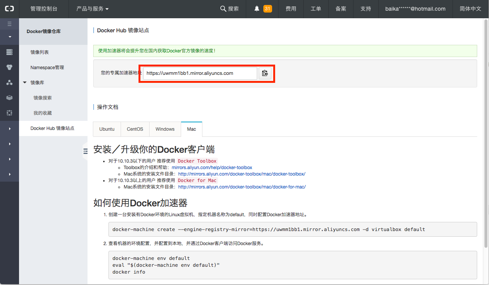

# Docker

## Docker CE for ubuntu

Install using the repository

<https://docs.docker.com/engine/installation/linux/docker-ce/ubuntu/>

### SET UP THE REPOSITORY

1. Install packages to allow apt to use a repository over HTTPS:

    Update package index
    
    ```bash
    sudo apt update
    ```
    
    install packages
    
    ```bash
    sudo apt-get install \
        apt-transport-https \
        ca-certificates \
        curl \
        software-properties-common
    ```
    
1. Setup the __stable__ repository
    
    Add Docker’s official GPG key

    ```bash
    curl -fsSL https://download.docker.com/linux/ubuntu/gpg | sudo apt-key add -
    ```
    
    Verify that you now have the key with the fingerprint `9DC8 5822 9FC7 DD38 854A E2D8 8D81 803C 0EBF CD88`
    by searching for the last 8 characters of the fingerprint.
    
    ```bash
    sudo apt-key fingerprint 0EBFCD88
    
    pub   4096R/0EBFCD88 2017-02-22
          Key fingerprint = 9DC8 5822 9FC7 DD38 854A  E2D8 8D81 803C 0EBF CD88
    uid                  Docker Release (CE deb) <docker@docker.com>
    sub   4096R/F273FCD8 2017-02-22
    ```
    
    ```bash
    sudo add-apt-repository \
       "deb [arch=amd64] https://download.docker.com/linux/ubuntu \
       $(lsb_release -cs) \
       stable"
    ```
 
### INSTALL DOCKER CE

1. update package index

    ```bash
    sudo apt update
    ```

1. Install the latest version or a specific version. Any existing installation is replaced

    ```bash
    sudo apt install docker-ce
    ```

    On production systems, you should install a specific version of Docker CE instead of always using the latest. 
    This output is truncated. List the available versions.

    ```bash
    sudo apt-cache madison docker-ce

    docker-ce | 17.06.0~ce-0~ubuntu | https://download.docker.com/linux/ubuntu xenial/stable amd64 Packages
    
    sudo apt install docker-ce=<VERSION>
    ```

    > NOTE: Installing or updating without specifying a version in the `apt-get` install or
     `apt-get` update command will always install the highest possible version
 
1. Verify Docker CE installation

    ```bash
    sudo docker run hello-world
    ```
1. Add user to the group docker
    
    Resolve the issue 
    
    ```bash
    docker: Got permission denied while trying to connect to the Docker daemon socket at unix:///var/run/docker.sock: Post http://%2Fvar%2Frun%2Fdocker.sock/v1.26/containers/create: 
    dial unix /var/run/docker.sock: connect: permission denied.
    See 'docker run --help'.
    ```
    
    <https://techoverflow.net/2017/03/01/solving-docker-permission-denied-while-trying-to-connect-to-the-docker-daemon-socket/>
    
    ```bash
    sudo adduser <user> docker
    # or
    sudo usermod -a -G docker <user>
    ```
    
## Nvidia Docker

<https://github.com/NVIDIA/nvidia-docker#quick-start>

```bash
# Install nvidia-docker and nvidia-docker-plugin
wget -P /tmp https://github.com/NVIDIA/nvidia-docker/releases/download/v1.0.1/nvidia-docker_1.0.1-1_amd64.deb
sudo dpkg -i /tmp/nvidia-docker*.deb && rm /tmp/nvidia-docker*.deb

# Test nvidia-smi
nvidia-docker run --rm nvidia/cuda nvidia-smi
```

## Docker Mirror

aliyun Docker Image Repository: <https://cr.console.aliyun.com>



### Ubuntu

```bash
sudo mkdir -p /etc/docker
sudo vim /etc/docker/daemon.json <<- 'EOF'
{
    "registry-mirrors":["https://uwmm1bb1.mirror.aliyuncs.com"]
}
EOF
sudo systemctl daemon-reload
sudo systemctl restart docker
```