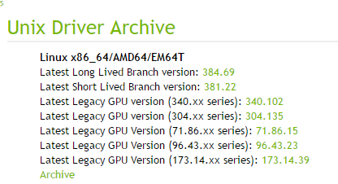
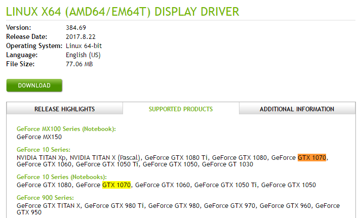
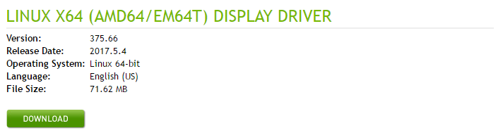

# NVIDIA Driver

## Check Nvidia graphic card

<https://askubuntu.com/questions/524242/how-to-find-out-which-nvidia-gpu-i-have>

Update the PCI info

```bash
sudo update-pciids
```

Show graphic card info

```bash
lspci -nn | grep '\[03'

01:00.0 VGA compatible controller [0300]: NVIDIA Corporation GP104 [GeForce GTX 1070] [10de:1b81] (rev a1)
```

> NOTE: If it's ambiguous, you could search the PCI ID (something like [10de:11bc]) 
on the Internet for the corrent model name.

## Check the Nvidia Driver Version

1. Check __Linux x86_64/AMD64/EM64T__ in the `Unix Driver Archive` list
    
    <http://www.nvidia.com/object/unix.html>
    
    

1. Check if the driver is supported by the graphic card.

    <http://www.nvidia.com/Download/driverResults.aspx/123103/en-us>
    
    

## Instal Nvidia Driver

### Install using package

<http://www.nvidia.com/Download/driverResults.aspx/118290/en-us>



### Install using PPA 

<http://www.linuxandubuntu.com/home/how-to-install-latest-nvidia-drivers-in-linux> 

1. Check if the latest driver supported by the PPA is available for the graphic card

    <https://launchpad.net/~graphics-drivers/+archive/ubuntu/ppa>

1. Remove older driver
    
    ```bash
    sudo apt purge nvidia*
    ```
    
1. Add the PPA
    
    ```bash
    sudo add-apt-repository ppa: graphics-drivers
    sudo apt update
    ```
    
1. Install the latest dirver

    ```bash
    sudo apt install nvidia-375.66
    ```

1. Reboot and check the installation status

    ```bash
    lsmod | grep nvidia
    ```
    
    If there is no output then your installation has probably failed. It is also possible that the driver is not 
    available in your system's driver database. You can run the following command to check if your system is running 
    on the open source driver nouveau. If the output is negative for nouveau, then all is well with your installation.
     
    ```bash
    lsmod | grep nouveau
    ```

1. Prevent automatic updates
    
    ```bash
    sudo apt-mark hold nvidia-375.66
    ```

1. Removal
    1. Remove above PPA
    1. Rmove Driver
    ```bash
    sudo apt purge nvidia*
    ```
    1. Reboot PC
    
    